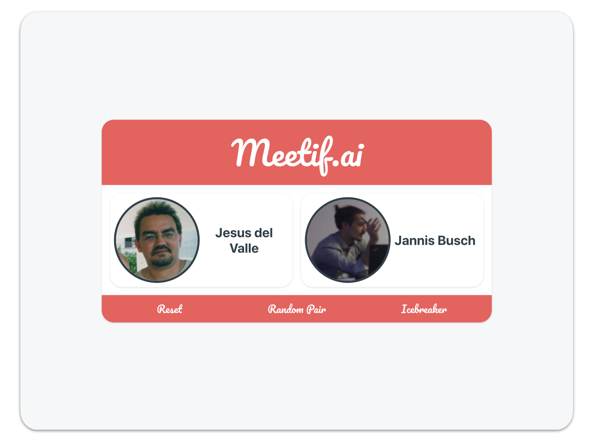
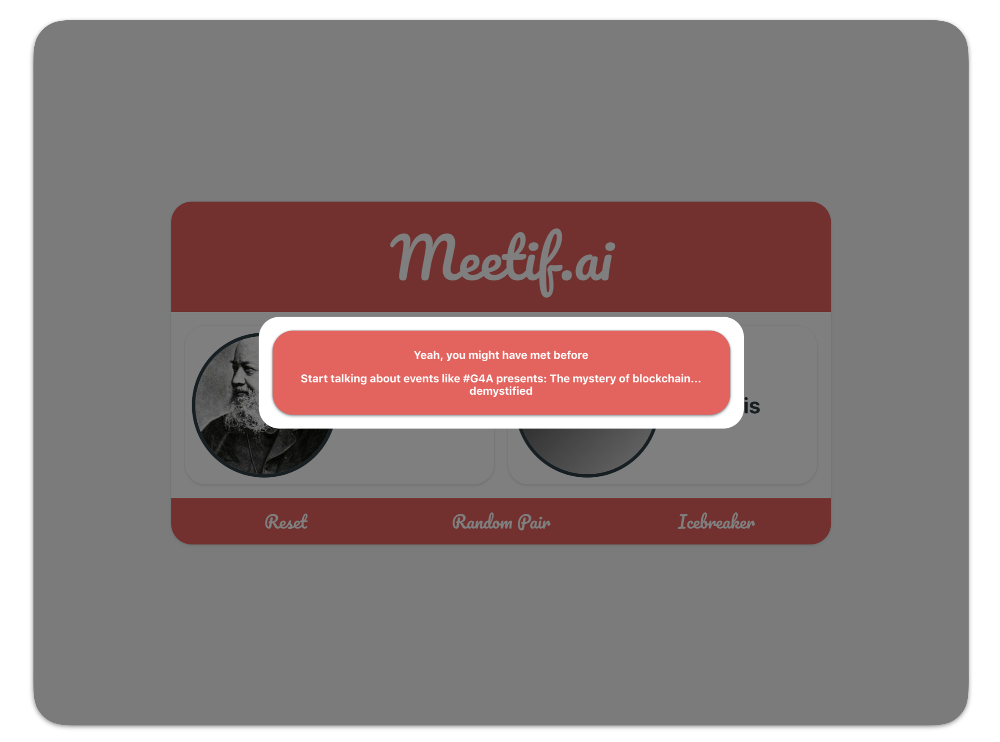
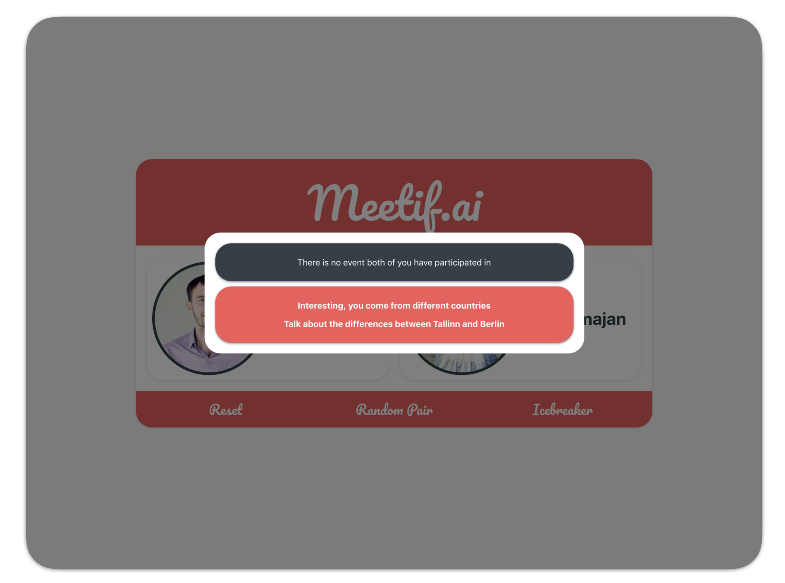
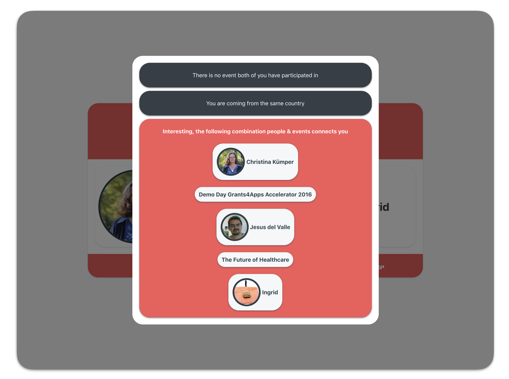
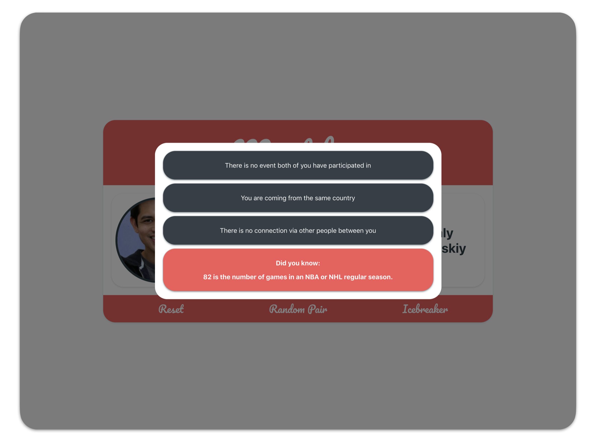
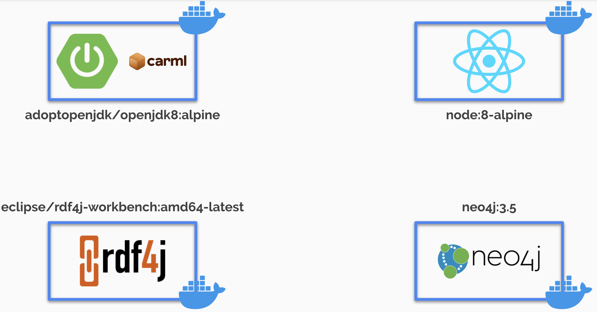

# Meetif.ai 
> Knowledge Graph to break the Ice ❄️

# What is __Meetif.ai__ about?
This repository contains a social knowledge graph (_meetif.ai_) for educational purposes. 
It fetches data from the social event platform Meetup.com and creates a graph containing events, groups, members, etc.
This graph is utilized to generate [INSERT LINK TO UD OR WIKI OF ICEBREAKER]()between people ([INSERT LINK TO ICEBREAKER HERE]()). 
It is noteworthy that the actual raw data is **not contained** in this repository.
Please see [INSERT LINK TO MEETUP API HERE]() for more information how to communicate with the Meetup.com API.

# What "Icebreaker" are available?

## Icebreaker 1 - Common Events 🎫
> The first icebreaker suggests events that both persons have been participated in.

[What is happening in the background?]()

## Icebreaker 2 - Cultural Differences 👽
> If there is no common event, there might be cultural differences that are interesting to talk about.

[What is happening in the background?]()

## Icebreaker 3 - friend of a friend of a friend ... 👫👫👫
> Yet another option is to check, if you participated in an event with somebody who participated in another event, where also another person participated, who participated in another event, ..., until you reach the other person.

[What is happening in the background?]()

## Icebreaker 4 - Facts! 🧠
If none of the aforementioned icebreakers can be applied, there are only facts left.
Those include statements like `1000000000000 is the number of bacteria on the surface of the human body`
or 
`250 is the number of Pokémon originally available in Pokémon Gold and Silver before Celebi was added`.

[What is happening in the background?]()

# Technical Background

## How to start Meetif.ai?
In order to start the Knowledge Graph run the following command:
`docker-compose -f "docker-compose.yml" up -d --build`

This will start the containerized structure of Meetif.ai which is depicted in the following figure.

## Icebreker - behind the scenes

### Icebreaker I

1. an HTTP request is sent to the backend
2. a SPARQL query is raised against the RDF server 
3. the result of the SPARQL query is returned to the backend ...
4. ... and to the frontend

### Icebreaker II

1. an HTTP request is sent to the backend
2. a SPARQL query is raised against the RDF server which is federated to [LINK TO DBPEDIA]()
3. the result of the SPARQL query is returned to the backend ...
4. ... and to the frontend

### Icebreaker III

1. an HTTP request is sent to the backend
2. a CYPHER query (including graph traversals) is raised against Neo4j
3. the result of the CYPHER query is returned to the backend ...
4. ... and to the frontend

### Icebreaker IV

1. an HTTP request is sent to [Numbers API](http://numbersapi.com/)
3. the result of the CYPHER query is returned to the frontend

### Knowledge Graphs

### Frameworks

| Frameworks | Purpose | Website |
| --- | --- | --- |
| RDF4J | store RDF and handle RDF I/O | --- |
| Neo4j | enabling graph traversals | --- |
| Spring Boot | Backend| --- |
| React | Frontend | --- |

### Infrastructure
| Tool | Purpose | Website |
| --- | --- | --- |
| Gradle | Build Tool | --- |
| Docker | Handling Infrastructure Components| |

### (Programming) Languages

| Language | Purpose | Website |
| --- | --- | --- |
| Kotlin | Backend | |
| Typescript | Frontend | |
| RML | JSON to RDF transformation | --- |
| SPARQL | RDF Querying | --- |
| CYPHER | Neo4j Querying | --- |

### Utilized Vocabularies

| Ontology | Mainly used for | Website |
| --- | --- | --- |
| foaf |  Persons | |
| schema | Events | |
| dbr | DBPedia Resources | |

# How to contribute
Yes, there are lot of options to further improve this repository.
As it's main purpose is to show the possible combination of building blocks,
general best practices of software engineering (e.g. TDD) have been neglected.

You are more than happy to raise issues, refactor, open pull requests and improve this repository 🙂